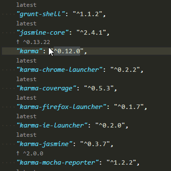

# Version Lens - VsCode Extension

[](http://travis-ci.org/vscode-contrib/vscode-versionlens "Check this project's build status on TravisCI")

Compares a single or ranged version against each package and displays the latest version if not satisfied; otherwise provides a satisfied indicator.

**Note:** Replaces the version text but does not automatically install packages when clicking a code lens link. 

Supports

- bower http://bower.io/
- dotnet http://www.dotnetfoundation.org/
- dub https://code.dlang.org, and
- npm https://www.npmjs.com/

### Preview



## Install

[How to install vscode extentions](https://code.visualstudio.com/docs/editor/extension-gallery)

### Available Workspace\\User Settings

```js
{
  // Inserts this prefix before the version when clicking on the code lens link.
  "versionlens.versionPrefix": "" // left blank as default
}
```

### Change Log

- 0.4.3
  - Fixes versionlens for dub sub packages

- 0.4.2
  - Transferred this project over to https://github.com/vscode-contrib/vscode-versionlens

- 0.4.1
  - replaces internal json module with external
  - replaces internal request module with external

- 0.4.0
  - Adds dotnet project.json support
  - Fixes issue when a child version entry is not present

- 0.3.0
  - Adds dub dub.json support

### Contributors

These are the people that have contributed code to this project:

- [pflannery](https://github.com/pflannery) — [view contributions](https://github.com/vscode-contrib/vscode-versionlens/commits?author=pflannery)
- [WebFreak001](https://github.com/WebFreak001) — [view contributions](https://github.com/vscode-contrib/vscode-versionlens/commits?author=WebFreak001)

### License

Licensed under MIT

Copyright &copy; 2016+ contributors (https://github.com/vscode-contrib/vscode-versionlens/graphs/contributors)
