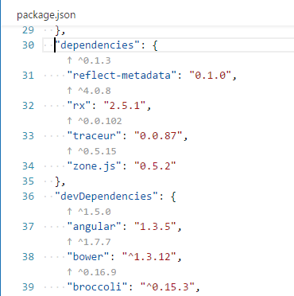
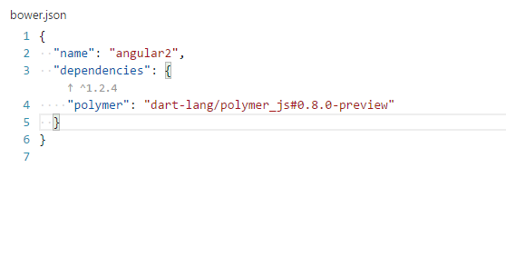

# Version Lens - VsCode Extension

 

Shows the latest version for an npm or bower package using the code lens interface. 

**Note:** Currently replaces the version text but does not automatically install packages when clicking a code lens link.

## Install

[How to install vscode extentions](https://code.visualstudio.com/docs/editor/extension-gallery)

### Preview

### Sponsors

No sponsors yet! Will you be the first?

### Contributors

These are the people that have contributed code to this project:

- [pflannery](https://github.com/pflannery) — [view contributions](https://github.com/pflannery/vscode-versionlens/commits?author=pflannery)

### License

Licensed under MIT

Copyright &copy; 2016+ pflannery (https://github.com/pflannery)
