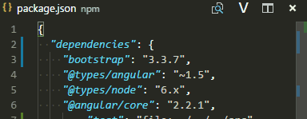

# Version Lens

Shows package version information for npm, jspm, bower, dub and dotnet core in the [Visual Studio Code](https://github.com/microsoft/vscode) editor.

### Preview

Provides editor toolbar icons for 

  - showing and hiding versions, and 
  - showing and hiding tagged versions. i.e. alpha or beta

**Note:** Replaces the version text but does not automatically install packages when clicking a code lens link. 

Supports

- bower http://bower.io/
- dotnet http://www.dotnetfoundation.org/
- dub https://code.dlang.org/
- jspm http://jspm.io/, and
- npm https://www.npmjs.com/

## Install

[How to install vscode extentions](https://code.visualstudio.com/docs/editor/extension-gallery)

### Contributors

These are the people that have contributed code to this project:

- [pflannery](https://github.com/pflannery) — [view contributions](https://github.com/vscode-contrib/vscode-versionlens/commits?author=pflannery)
- [WebFreak001](https://github.com/WebFreak001) — [view contributions](https://github.com/vscode-contrib/vscode-versionlens/commits?author=WebFreak001)
- [eamodio](https://github.com/eamodio) — [view contributions](https://github.com/vscode-contrib/vscode-versionlens/commits?author=eamodio)

### License

Licensed under MIT

Copyright &copy; 2016+ contributors (https://github.com/vscode-contrib/vscode-versionlens/graphs/contributors)
